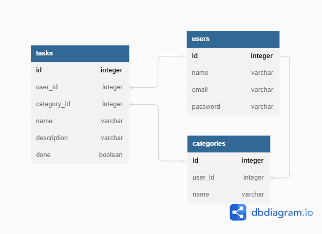

# Tasks API (with nodejs, knex, swagger, JWT)

A simple tasks api with nodejs, knex, joi, jwt and swagger

## Install

```
$ git clone https://github.com/danielschmitz/tasks-node-knex-swagger.git
$ cd tasks-node-knex-swagger
$ npm install
$ cp .env.example .env
$ npm run createdb
$ npm run dev
```

Go to http://localhost:3000/swagger

## How get the Authorization Token 

To make some calls to the API, you must be logged in. To do this, go to the `/auth/login` row in swagger and click on the "Try it Out" button:

<details>
  <summary>Image Example</summary>
  
</details>

The swagger setup already comes with the email and password information for user 1. Thus, you do not need to provide any information. Just click the "Execute" button

<details>
  <summary>Image Example</summary>
  
</details>

After performing this action, you get the authentication token as an answer:

<details>
  <summary>Image Example</summary>
  
</details>

Copy the token, go to the top of the page, and click on the "Authorize" button. 

<details>
  <summary>Image Example</summary>
  
</details>

With this token, you can access other API calls, such as "/categories".

## Database

The database used in development mode is sqlite3. And in production, postgreSQL.

<details>
  <summary>ORM</summary>
  
</details>

## Deploy

TODO

## Important Files

- `.env` Sets the JWT SECRET and the DATABASE_URL (in production mode)
- `knexfile.js` Knex configuration https://knexjs.org/
- `src/swagger.js` Swagger configuration. At the end of the file, in `endpointsFiles` the api files are added to swagger generate.
- `src/api/` Contains the api, where each file is an api of a certain entity and in `index.js` those files are exported to node.

## Migration and Seeds

The migration CLI is bundled with the knex install, and is driven by the node-liftoff module. To install globally, run:

```
$ npm install knex -g
``` 

Creating new migration files can be achieved by running:

```
$ knex migrate:make migration_name
```

Once you have finished writing the migrations, you can update the database matching your NODE_ENV by running:

```
$ knex migrate:latest
```

To create a seed file, run:

```
$ knex seed:make seed_name
```

To run seed files, execute:

```
$ knex seed:run
```
